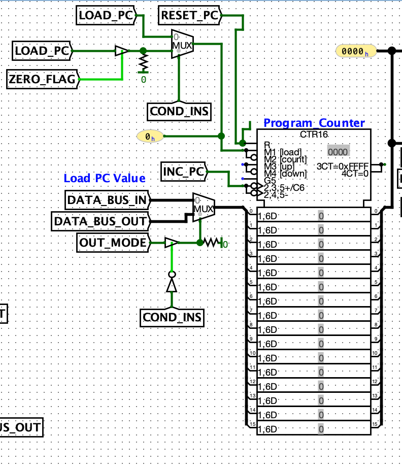
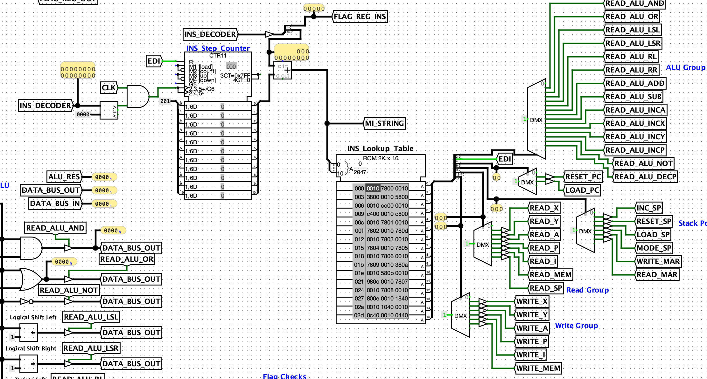
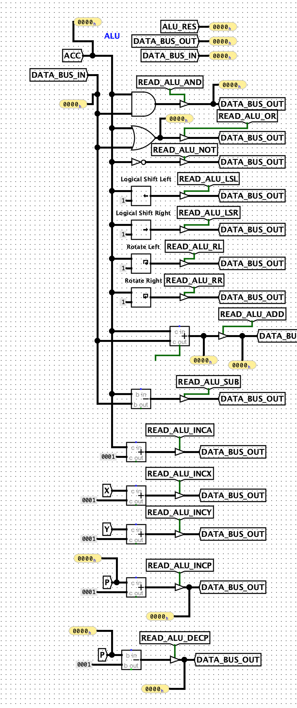
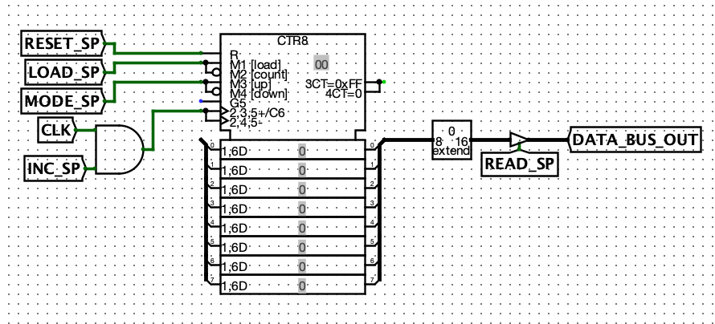

# Overview

Guin-16 is a 16-bit CPU based on the [Von Neumann architecture](https://en.wikipedia.org/wiki/Von_Neumann_architecture). This CPU was built as a capstone project at Youngstown State University. Guin-16 was built using the [Logisim-Evolution](https://github.com/logisim-evolution/logisim-evolution) digital logic simulator and utilizes many of the features of the program.

Guin-16 features a custom instruction set with instructions and addressing modes inspired by the [6502 processor](https://en.wikipedia.org/wiki/MOS_Technology_6502) and the [Astro-8 computer](https://sam-astro.github.io/Astro8-Computer/). There are 32 unique instructions, some of which have multiple addressing modes available for efficient memory management.

A unique feature of the Guin-16 is the [Page Register](registers.md), which holds the index of a page in memory that can be accessed more efficiently than a typical relative memory access. This can be thought of as a dynamic [zero page](http://www.6502.org/users/obelisk/6502/addressing.html#ZPG), which is utilized in the 6502 processor.

## Installation
You can install and use the Guin-16 yourself, the circuit (as well as the source for this site and my presentation) can be found [here](https://github.com/shogrenjacob/16-bit-cpu). More information on installation requirements and running programs can be found on the [installation page](installation.md).

## Specifications
The features of the Guin-16 CPU are as follows:

* 65,535 memory addresses
* 5 flags (Zero, Carry, Overflow, Parity, Negative)
* [Two's Complement](https://en.wikipedia.org/wiki/Two%27s_complement) number system
* 7 Registers (X, Y, Accumulator, Page, Instruction, Flag, MAR)
* [Carry-lookahead addition](https://en.wikipedia.org/wiki/Carry-lookahead_adder)

## Guin-16 Circuit Components

### Registers
The Guin-16 has seven registers: 2 general-purpose registers (X and Y), an Accumulator, a Page Register, an Instruction Register, a Flag Register, and a Memory Address Register (MAR). These are talked about more in-depth on the [Registers Page](registers.md).

### Program Counter
The Program Counter tells the Guin-16 which memory address to perform actions on at a given clock tick. This is typically incremented sequentially during processing but can be given a specific address to jump to.

</img>

### Control Unit
The Control Unit is given instructions from RAM and decodes the instructions into microinstructions which tell the Guin-16 what operations should be performed. It uses an instruction lookup table to translate instruction opcodes into their hardware-specific operations.

</img>

### ALU
The Arithmetic Logic Unit (ALU) is responsible for performing arithmetical operations on data given by different registers and RAM. If there is a two operand operation to be performed, one of the operands will _always_ be the Accumulator register, which is used to hold intermediate operations for the ALU.

</img>

### Stack Pointer
The Stack Pointer tells the CPU at what address the top of the stack is. The stack is a reserved page of memory to store data in a stack data structure. If the stack pointer falls below zero it will wrap around to _xFF_ and vice versa if it overflows past _xFF_.

</img>

## References
I used the following resources in researching and building this project:

[6502 Reference](http://www.6502.org/users/obelisk/6502/)

[Implementing a One Address CPU in Logisim (Kann)](https://eng.libretexts.org/Bookshelves/Electrical_Engineering/Electronics/Implementing_a_One_Address_CPU_in_Logisim_(Kann)/05%3A_CPU_Implementation)

[Memory Address Register Reference](https://en.wikipedia.org/wiki/Memory_address_register)

[Program Counter Reference](https://www.sciencedirect.com/topics/computer-science/program-location-counter)

[Astro-8 Computer](https://sam-astro.github.io/Astro8-Computer/docs/Architecture/Memory%20Layout.html)