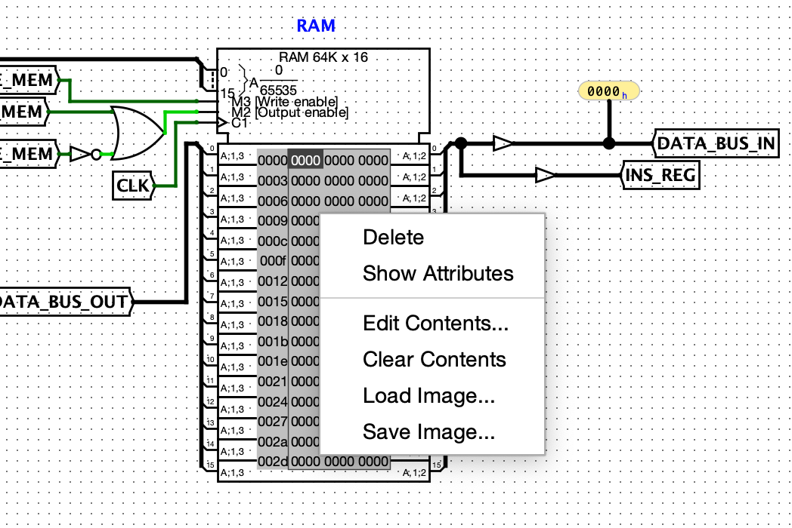
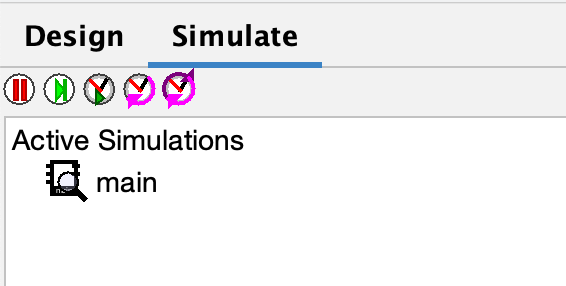

# Installation
The circuit simulation of the Guin-16 CPU was made using [Logisim-Evolution](https://github.com/logisim-evolution/logisim-evolution?tab=readme-ov-file#download), an open-source digital logic simulator, and requires the software to run. The Github repository contains information on downloading the software.

Once Logisim-Evolution is installed, you can clone or download my [Github Repository](https://github.com/shogrenjacob/16-bit-cpu), which contains a circuit file named _capstone.circ_ as well as a folder titled _ROMs_ that contains some tests and sample programs to run on the Guin-16.

Once you've downloaded _capstone.circ_, you can open Logisim-Evolution and open my CPU by navigating to _File_ &rarr; _Open_ &rarr; _The location of your local version of my circuit_.

## Run a Program
Once the circuit loads, you can run a program by right clicking on the RAM component (as seen below) and clicking the _Edit Contents_ option from the dropdown. 

This will open a large file of hex values, but at the bottom there is an open button to select a pre-defined file to run. I have made some tests and a program named _fib.txt_ that calculates the 8th value in the [Fibonacci Sequence](https://en.wikipedia.org/wiki/Fibonacci_sequence). You can also create your own programs using the Opcodes from the [Instruction Set](instruction-set.md).

Once you've loaded your program into RAM, click the _Simulate_ tab on the left side of the screen and click the middle option of the five clock options at the top of the menu. This will run the program in real time, and at a pretty quick pace. If you would like to step through the program one clock tick at a time, you can click the fourth option of the menu, which will progress the CPU by one clock tick.

