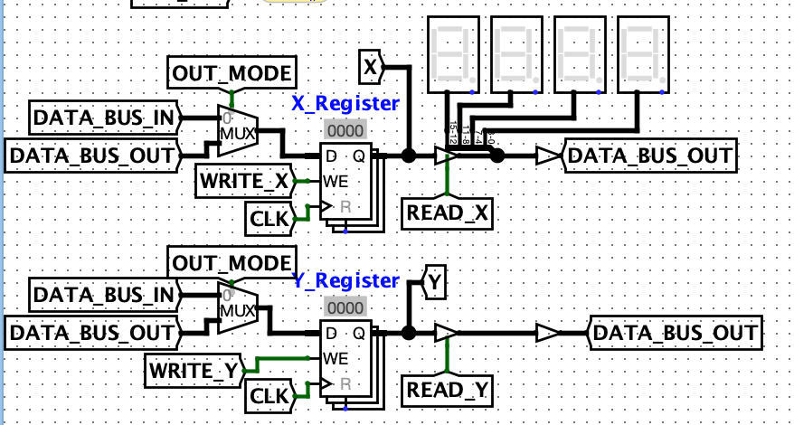
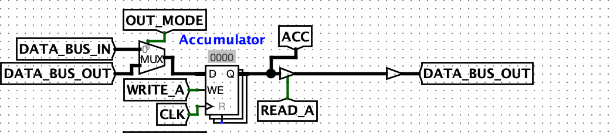
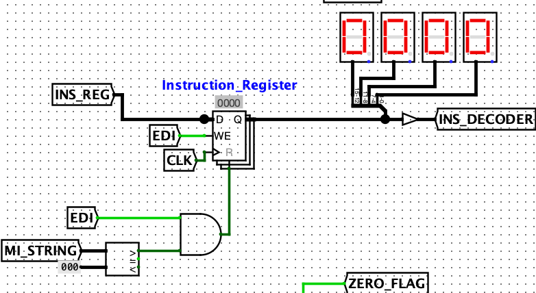
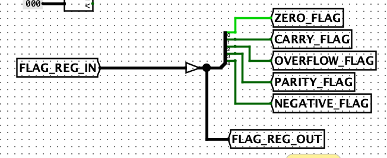
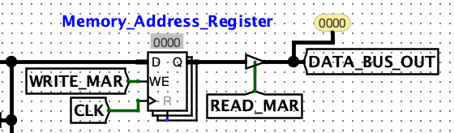

The Guin-16 features seven registers: general purpose registers X and Y, the Accumulator, a Page Register, an Instruction Register, a Flag Register, and a MAR.

## X and Y Registers
X and Y are two general-purpose registers that can hold 16-bit values and accessed with read and write operations.

## Accumulator
The Accumulator is a register specifically used as an operand for ALU operations and ALU intermediate operations. The Accumulator also has load and store operations, but should be used to mostly for ALU calculations rather than as a general-purpose register.

## Page Register
The Page Register holds the amount of pages to jump when using the JMPP instruction. The value held in this register does not denote the actual memory address that JMPP will jump to, just the amount of pages.
> For example, a Page Register value of 1 jump to address 0xff in memory, the start of the second page.

## Instruction Register
The Instruction Register holds the opcode of the instruction currently being processed. Once the end of an instruction is reached, the Instruction Register is reset and ready to be written to. The Instruction Register can only be read into the Instruction Decoder.

## Flag Register
The Flag Register is simply a 5-bit integer that holds the which flags are currently being raised during CPU processing.

## MAR (Memory Address Register)
The Memory Address Register (MAR) is a register that holds the memory address to return back to during non-immediate addressing modes. Essentially, the MAR tells the PC where to return to after we have used the data we need at an indirect address.

